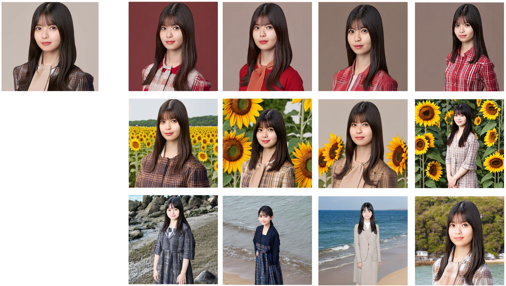

# Encoder for SatbleDiffusion Fast Personalization 
This is unofficial implementation of [Encoder-based Domain Tuning for Fast Personalization of Text-to-Image Models](https://tuning-encoder.github.io/). The code is based on [Huggingface diffusers](https://github.com/huggingface/diffusers).

This code is not exactly the same as the original paper, we use LORA instead of Weight Offsets.


## Environment 
    pip install -r requirements.txt

## Model Pretraining (using stablediffusion v1.5 based model achieves better result)
```bash
accelerate config
accelerate launch train.py --pretrained_model_name_or_path "runwayml/stable-diffusion-v1-5" --images_dir $FFHQ_DIR --lr_scheduler constant_with_warmup \
 --train_batch_size 5 --resolution 512  --scale_lr  --output_dir $MODEL_SAVE_DIR --num_train_epochs 10 --save_steps 10000 --learning_rate 1.6e-6 --lr_scheduler cosine_with_restarts --reg_weight 0.01 --lora_rank 64 --placeholder_token face
```

pretrained model is available at https://huggingface.co/yoctta/sd-personalization-encoder-face/tree/main
## Finetune and sample images
```bash
accelerate config
accelerate launch --multi_gpu sample.py --pretrained_model_name_or_path "runwayml/stable-diffusion-v1-5" \
  --model_path "$MODEL_SAVE_DIR/checkpoint-70000" --final_checkpoint \
  --image_path $INPUT_IMAGE_PATH \
  --train_batch_size 2 \
  --finetune_steps 15 --reg_weight 0.1 --resolution 512 \
  --prompt "a photo of face wearing sunglasses."   --placeholder_token face \
  --num_samples 2 --learning_rate 1.6e-5  --train_text_encoder --mixed_precision bf16 \
  --output_dir $OUTPUT_IMAGE_PATH

```
## Sampled Images
 